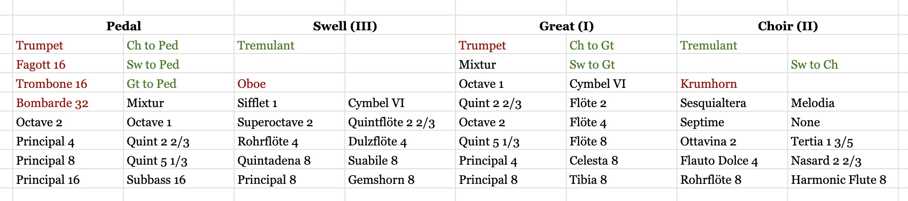

# Synopsis
Jamb is a stop tablet for [Aeolus](https://kokkinizita.linuxaudio.org/linuxaudio/aeolus/)

It allows for running Aeolus "headless", i.e. with just the text UI in a disconnected terminal (e.g. using [tmux](https://github.com/tmux/tmux/wiki)), and being able to control the stops with a [Launchpad Mini MK2](https://www.amazon.com/Novation-Launchpad-Compact-Controller-Ableton/dp/B00W5F3GJ0?th=1)

It supports toggling stop tabs - up to 16 buttons in up to 4 "groups" (in Aeolus parlance) that correspond directly to the Aeolus UI. The bottom-right button is for general cancel, and the one above that is a MIDI panic button (turn all sound off, to cancel stuck MIDI notes). The button above that is the "set" button and can be used in combination with the top row of buttons ("pistons") in the same way as a traditional combination action on an organ.

Jamb will automatically connect to Aeolus and a Launchpad Mini at startup if they're active.

Traditional organ consoles arrange stops in columns by division, with lower stops at the bottom (e.g. see [AGO Standard Console Specifications](https://wicksorgan.com/wp-content/uploads/2020/01/agoconsole.pdf)). In that spirit, the default stop layout is:



This assumes the default "Aeolus" instrument. See `jamb.config.yaml`.

[View a demonstration](https://www.youtube.com/shorts/1N0cK-HaY4k)

# Aeolus notes
You should run the Aeolus GUI and set up MIDI routing and audio settings, then exit cleanly so that tuning and settings are saved properly. Be sure to enable control on the first MIDI channel. You can connect from another machine running X (e.g. a Linux desktop or a Mac from [XQuartz](https://www.xquartz.org/)) or you can connect a keyboard, mouse, and display then run `startx`.

The text UI for Aeolus is poorly documented and doesn't expose the full functionality of the GUI, but here are a few things you can do (refer to Aeolus source for more):

Print stops, so you can make your reference card and/or label your buttons. e.g. for my instrument:
```
Aeolus> s ?
Stops in group II
  - rofl8     - hafl8     - fldo4     - nasard    - otta2   
  - tertia    - sesqui    - septim    - none      - krumh   
  - melod     - TR        - C2+3    
Stops in group I
  + prin8     - prin4     - oct2      - oct1      - qu513   
  - qu223     - tibia     - celes8    -           - flute4  
  - flute2    - cymb      - mixt      - trum8     - C1+2    
  - C1+3    
Stops in group III
  - prin8     - gems8     - quna8     - suab8     - rofl4   
  - dulz4     - fl223     - soct2     - siff1     - cymb    
  - oboe      - TR      
Stops in group P
  - subb16    - prin16    - prin8     - prin4     - oct2    
  - oct1      - qu513     - qu223     - mixt      - bass18  
  - trom16    - bomb32    - trum8     - CP+1      - CP+2    
```

Pulled stops have a `+`, e.g. `prin8` in group `I` above.

Pull or push a stop:
```
Aeolus> s II + rofl8
Aeolus> s I - prin8
```

# Raspberry Pi 
## Aeolus
I run Aeolus headless on a Raspberry Pi Zero 2W. Aeolus uses about 115MB and 30% CPU.

    apt-get install aeolus alsa-utils 

I copied the default instrument and tweaked it for manual order, and called it "Fuglerør" (i.e. I made `~/aeolus/stops/Fugleror/definition`). A stable ALSA address for my USB audio device is `hw:Schiit,0`.
My `~/.aeolusrc` looks like this:

    -u -S /home/fugalh/aeolus/stops -I Fugleror -A -d hw:Schiit,0

In tmux I start Aeolus:

    aeolus -t

Then in another tmux window I make my MIDI connections, and run jamb:

    aconnect -x && aconnect 'USB Uno MIDI Interface':0 aeolus:0 && \
    jamb

This could all be set up to happen automatically at boot, though I haven't yet.

## Install Aeolus, alsa-utils, and Jamb
    apt-get install aeolus alsa-utils libasound-dev libfmt-dev libyaml-cpp-dev

Build and install
    bash -x build.sh
    install linux/jamb /usr/local/bin

## Development
    apt-get install libasound-dev libfmt-dev libyaml-cpp-dev tup googletest

Note that if you try to run a parallel build you will probably run out of memory and start thrashing. Especially if you do it while also running Aeolus. For this reason, `bootstrap.sh` configures tup to use `-j1`.
I also suggest installing `swapspace` which will at least give a dynamic amount of swap if it's necessary, rather than oom-killing things.

Bootstrap development (do this once)

    ./bootstrap.sh

Build and run

    ./run.sh

Run tests

    ./test.sh

A full build of binary and tests from zero takes about 5 minutes on my Raspberry Pi Zero 2W.

# Mac setup (for core development)
Compilation on a Raspberry Pi Zero 2W is quite slow, so I do most of my development on my laptop with MIDI fakes and approval testing.

[Install buck2](https://buck2.build/docs/about/getting_started/#installing-buck2)
e.g. download the compressed binary then

    unzstd buck2-*
    mv buck2-* /usr/local/bin/buck2

Install dependencies with homebrew

    brew install fmt googletest yaml-cpp

Run tests

    ./test.sh

To regenerate `build.sh` needs a newer version of tup than is in Raspbian, so I run it on Mac:

    git clean -dxf
    tup init
    tup generate build.sh linux/jamb

# Future plans
- More robust auto-connect (if things (re)appear after startup)
- Support OSC control e.g. using TouchOSC on a phone or iPad or Android Tablet
- Support newer Launchpad Minis with more color (I suspect a new one would work fine out of the box, please let me know if you succeed)
- Support other touchpad interfaces (contributions welcome)

# Notes
On a pipe organ console, the panels of wood holding stop knobs or rocker tabs is called the stop jamb.